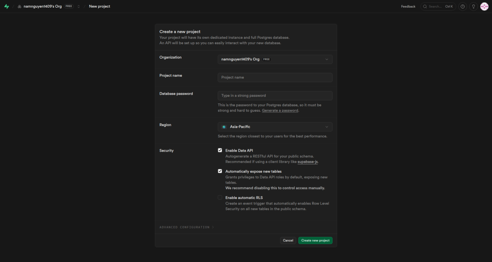

# 🖋️ ZenStory Elite - Nền tảng Light Novel Tự Thân (Self-hosted)

ZenStory Elite là giải pháp mã nguồn mở hoàn chỉnh giúp các tác giả và nhóm dịch Light Novel tự xây dựng nền tảng đọc truyện riêng biệt, bảo mật và thẩm mỹ cao mà không cần biết lập trình chuyên sâu.

## ✨ Tính năng nổi bật
- **Giao diện Reader Premium**: Tùy chỉnh Font chữ (Google Fonts), màu nền (Sepia, Dark, Night), khoảng cách dòng...
- **Bảo mật nội dung**: Chống copy, mã hóa nội dung bằng Glyph Mapping (Canvas Rendering).
- **Quản lý tác phẩm**: Hệ thống Admin chuyên nghiệp, quản lý tập (Volume), chương (Chapter), hẹn giờ đăng truyện.
- **Tối ưu SEO**: Tự động tạo Sitemap, Robots.txt, Meta Tags cho từng bộ truyện.
- **Tốc độ cực nhanh**: Xây dựng trên Next.js 15 và Supabase, mang lại trải nghiệm mượt mà nhất.

---

## 🚀 Hướng dẫn cài đặt nhanh (5 phút)

Dành cho các tác giả muốn sở hữu website ngay lập tức.

### Bước 1: Triển khai Website
Nhấn vào nút dưới đây để sao chép mã nguồn và đưa lên máy chủ Vercel (Miễn phí):

### Bước 2: Thiết lập Cơ sở dữ liệu (Supabase)
1. Truy cập [Supabase.com](https://supabase.com/) và tạo một dự án mới (Miễn phí).
2. Tìm mục **SQL Editor** ở cột bên trái.
3. Mở tệp [init_database.sql](./init_database.sql) trong dự án này, copy toàn bộ nội dung và dán vào SQL Editor của Supabase.
4. Nhấn **Run**.

### Bước 3: Cấu hình Biến môi trường
Trên trang Vercel, hãy điền các thông tin sau lấy từ mục **Settings > API** của Supabase:
- `NEXT_PUBLIC_SUPABASE_URL`: Đường dẫn dự án Supabase.
- `NEXT_PUBLIC_SUPABASE_ANON_KEY`: Mã công khai (anon key).
- `SUPABASE_SERVICE_ROLE_KEY`: Mã quản trị (service role key - dùng cho các tác vụ server).
- `NEXT_PUBLIC_SITE_URL`: Địa chỉ trang web của bạn (ví dụ: `https://my-story.vercel.app`).

---

## 🛠️ Tùy chỉnh & Quản trị
Sau khi cài đặt thành công, hãy truy cập vào đường dẫn `/login` trên trang web của bạn để đăng ký tài khoản. 

**Để trở thành Admin:**
1. Vào Supabase > Table Editor > bảng `profiles`.
2. Tìm dòng tài khoản của bạn và đổi cột `role` từ `reader` thành `admin`.

Bây giờ bạn có thể truy cập `/admin` để thay đổi màu sắc, phông chữ, logo và bắt đầu đăng những chương truyện đầu tiên!

## 🤝 Đóng góp
Nếu bạn gặp lỗi hoặc có ý tưởng mới, hãy mở một Issue hoặc Pull Request. Chúng tôi luôn chào đón sự đóng góp từ cộng đồng.

## 📄 Giấy phép
Dự án được phát hành dưới giấy phép MIT. Miễn phí cho mục đích cá nhân và thương mại.
